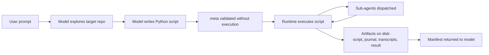
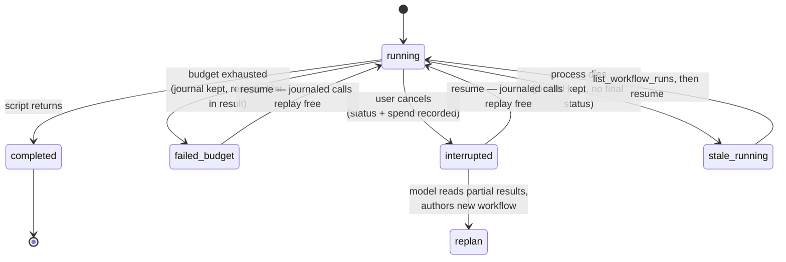
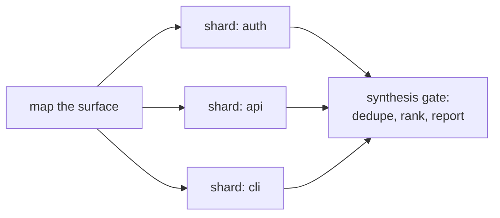
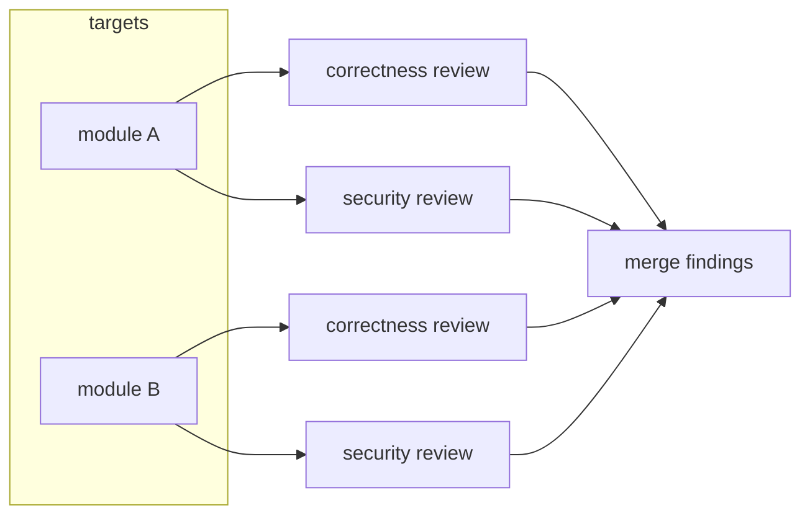
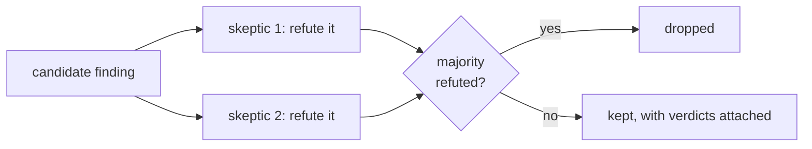
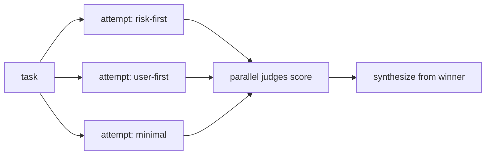
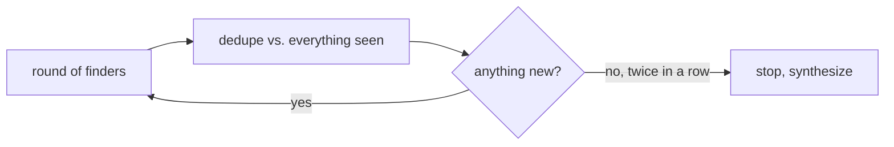
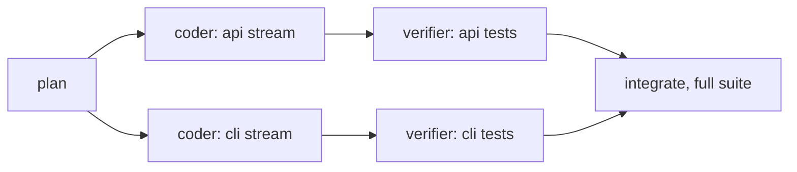
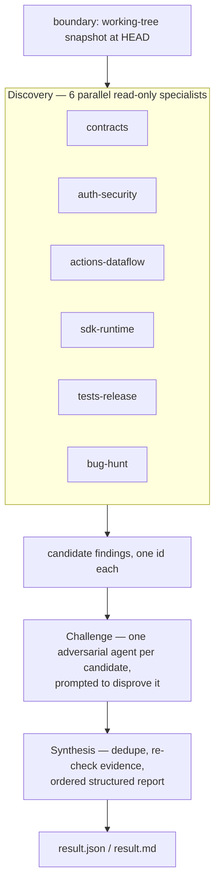

# How gigacode works

## What this is

Multi-agent work needs a defined structure. In graph frameworks, a developer writes that structure in code before the run. With ordinary agent delegation, the orchestrating model decides it turn by turn. Gigacode takes a third approach: the model writes a Python program for the current task, and a runtime executes it. The resulting structure is explicit, inspectable, and re-runnable, but it is not written in advance.

Gigacode is off by default and toggled per session with `/gigacode`. Everything below is derived from the code in this repository; file paths are given so you can check.

## The authoring loop

Turning gigacode on has two effects (`kolega_code/cli/tui/command_handlers.py`). It exposes a `run_workflow` tool to the top-level agent and adds an authoring guide to the system prompt (`kolega_code/agent/orchestration/guide.py`). The gate in `kolega_code/agent/tools.py` makes the tool available only to the top-level agent, never to sub-agents, and only while gigacode is enabled.

What happens next is model behavior rather than runtime enforcement. In practice, the model explores the target repo first and then emits a script. Short programs are supplied inline; longer ones are written to the session scratchpad and passed by path. The runtime becomes involved at `run_workflow`: it validates the script's `meta` block without executing anything (`extract_meta` in `kolega_code/agent/orchestration/executor.py`), persists the source, and runs it.

The guide defines which parts are scaffolded and which parts the model decides. It provides the primitive API and hard determinism rules (`import`, `open`, `time`, and `random` are unavailable in scripts). It requires unique fan-out labels and self-distinguishing prompts, explains the schema-unwrapping idiom, and gives token-budget sizing anchors measured from real runs. It also describes composable quality patterns (adversarial verification, judge panels, and loop-until-dry) as suggestions rather than templates. The guide explains that every completed `agent()` call is journaled, that resume matches calls by content rather than position, and that an interrupted run should be recovered by listing the session's runs and resuming instead of re-running. A model that recovers an interrupted workflow is following scaffold instructions. A six-specialist review with adversarial challenge, however, is the model's own design.



## The runtime API

The runtime (`kolega_code/agent/orchestration/runtime.py`) injects the primitives into a curated namespace and executes the script in-process, wrapped in an async function (`executor.py`). The namespace has a restricted builtins table: no `import`, `open`, `eval`, or `exec`, and no time or randomness. The executor's docstring explicitly describes this as a determinism aid, "a soft sandbox, not a security boundary." The security section below explains what actually bounds a workflow.

| Primitive | What it does | Failure contract (from code) |
| --- | --- | --- |
| `agent(prompt, label=, phase=, schema=, model_override=, agent_type=, browser_target=)` | Dispatch one sub-agent; returns its recap text, or a dict when `schema` is given | A failed or skipped agent returns `None`. It does not raise, and there is no automatic retry. Invalid arguments (bad `model_override` shape, legacy kwargs, empty prompt) raise `WorkflowScriptError` before dispatch. Budget or agent-cap exhaustion raises at admission. |
| `schema=` | Forces structured output: the schema becomes the input schema of a `submit_result` tool exposed to the worker (`kolega_code/agent/tool_backend/agent_tool.py`) | If the worker finishes without calling `submit_result`, it is re-prompted once; if it still doesn't, `agent()` returns the worker's prose recap instead of a dict. Conformance is only as strong as the provider's tool-argument validation. The runtime has no separate schema validator. |
| `parallel(thunks)` | Run thunks concurrently, wait for all (a barrier); fan-out capped at 4,096 items | A thunk that raises resolves to `None`; the drop is logged and recorded in the transcript with the exception and the script line it came from. Budget/agent-cap exhaustion is not swallowed: it cancels and drains the remaining children, then fails the run. |
| `pipeline(items, *stages)` | Run each item through all stages independently, no barrier between stages; stages receive `(prev, item, index)` with arity adaptation | Same drop-and-record contract per item; a raising stage drops that item and skips its remaining stages. |
| `phase(title)`, `log(msg)` | Progress grouping and narration in the UI | None; display only. |
| `budget` | `total`, `spent()`, `remaining()`; checked before each dispatch (`accounting.py`, `budget.py`) | Reaching the ceiling blocks further dispatches; calls already in flight finish (bounded overshoot). The run warns at 75% and 90% spend. |
| `agent_type=` | `general` (full toolset), `investigation` (read-only), `coder`, `browser` (`workflow_tool.py`) | Unknown types fall back to `general`. In plan mode every worker is forced to the read-only investigation agent regardless of what the script asked for. |
| `label=` | Names the agent in transcripts, progress lines, and artifact filenames | Display only. Duplicate labels log a one-time hint; they are never part of resume identity (`types.py` excludes label and phase from the cache key), so a collision cannot corrupt replay. |

Workers are leaves by default: `max_agent_depth` is 1, the hard maximum is 2 (one worker-to-child hop), and no worker can call `run_workflow`. Concurrency is capped at `min(8, cores − 2)` with a small random stagger so a fan-out doesn't spike provider rate limits. A lifetime cap of 1,000 agents per run is a runaway-loop backstop.

## Execution and the journal

Every run gets a directory under the CLI state dir (`kolega_code/agent/orchestration/journal.py`):

```
<state-dir>/workflows/<run_id>/
    script.py        the executed source, byte-for-byte
    run.json         status, owning session, timestamps, token totals,
                     script-exception drop count, artifact paths
    journal.jsonl    one row per completed agent() call — the resume record
    transcript.jsonl raw events (phases, logs, drops, cached replays)
    transcript.md    readable transcript with a per-call index
    result.json/.md  the script's return value
    agents/          per-agent raw and readable transcripts
```

The journal is written as calls complete, not at the end, so a run killed at any point keeps everything that finished. Each row records the call's position, its content key, label, status, and return value.

Resume identity is based on content, not position. The key is a hash of every semantically significant input to the call: prompt, schema, model override or inherited routing fingerprint, agent type, read-only mode, and delegation depth (`types.py`). Label and phase are deliberately excluded as cosmetic. On `run_workflow(resume_from_run_id=...)`, journaled values are grouped by key and replayed FIFO in their original order (`journal.py`, `runtime.py`). A call with unchanged content replays from the journal at zero token cost even if its position changed. A call with changed content misses the cache and runs live. Reordering or inserting calls does not invalidate the rest. Failed calls are never cached, so they run again. Resumed runs record replayed calls again, which allows a resume of a resume to replay exactly. The key itself handles staleness: changing a prompt causes that call, and only that call, to run live.

## Interruption and recovery

Three ways a run stops early, all recorded truthfully in `run.json` (`workflow_tool.py`):

- **Cancellation** (user stops the turn): the run is marked `interrupted` with its duration and token spend before the exception propagates.
- **Budget exhaustion**: the run fails with the exact overrun. The tool result tells the model that the run is resumable, gives the `resume_from_run_id` call to make, and reports how many journaled calls will replay free.
- **Process death**: nothing gets to write a final status; the run stays `running` on disk, and the listing described below reports that state as `running`.

Recovery has two modes, and the claim discipline matters here:

1. **Replay the persisted program.** This is a runtime guarantee: `resume_from_run_id` re-reads the stored script, replays every journaled completed call by content, and runs only the remainder. The session-scoped `list_workflow_runs` tool lets the model recover a run ID it never received. An interrupted call returns no result, so runs are stamped with their owning session and listed with status, token counts, and journaled-call counts. Session identity survives process restarts. After the session is resumed, a run orphaned by a crash is still findable and resumable.
2. **Author a new program over completed outputs.** This is model behavior. Every run's result and transcript are on disk at paths the model knows; nothing stops it reading a dead run's partial output and writing a fresh workflow that starts from there. The runtime contributes persistence; the strategy is the model's.

The scaffold instructs the model to prefer mode 1 over re-running from scratch. In our experience, the model follows that instruction, but this is an observation rather than a guarantee. (This repo's CHANGELOG records the motivating failure: before content-keyed replay, one production resume salvaged only 6 of 91 completed calls.)



## Security model

The top-level agent can already run arbitrary shell commands through its ordinary tools. A workflow script does not grant the model a new capability; it changes how work is organized. The constraints below apply to the workflow *mechanism*, not the model.

- **The script itself has no I/O.** It executes in-process against a curated namespace (`executor.py`): no `import`, no `open`, no `eval`/`exec`, no network, no clock, no randomness. Its only effectful primitive is `agent()`. This restriction exists to keep scripts deterministic for resume; the code comments say plainly that it is not a hardened sandbox, and we repeat that here.
- **Effects go through sub-agents, which are typed.** `investigation` workers have read-only toolsets; in plan mode the dispatch adapter forces *every* worker to the read-only investigation agent no matter what the script requested (`workflow_tool.py`). `coder` and `general` workers in build mode have the full toolset.
- **Build-mode workers run without permission prompts.** Workflow sub-agents are constructed with auto permission mode regardless of the session's mode (`agent_tool.py`). Pausing a fan-out for per-agent approvals would be unworkable, so a workflow is a deliberate batch operation. This is the main risk of the model: if you would not run the task under auto permissions, do not run it as a build-mode workflow. The same caution appears in the user docs.
- **Structural caps.** Workers cannot start workflows; delegation depth is capped at 2; 4,096 items per fan-out; 1,000 agents per run; concurrency `min(8, cores − 2)`; an optional hard token ceiling. Every sub-agent's full trajectory is persisted under the run directory for audit.

What a workflow cannot do: prompt the user mid-run, exceed its caps, nest another workflow inside a worker, or (in plan mode) touch the working tree at all.

## Workflow shapes

The authoring guide teaches a vocabulary of orchestration shapes (`kolega_code/agent/orchestration/guide.py`) that the model can combine. These are prose suggestions, not templates or library calls. The guide names each shape and its purpose, while the model writes the loops and fan-outs and can combine or depart from the suggestions. The shapes below are structurally distinct. The guide also lists task-level variants (research funnel, migration factory, failure triage loop, and loop-until-budget).

**Shard-and-sweep:** Split a large surface into disjoint shards, send one focused agent per shard, then merge. A surface-mapping agent usually runs first, and its output becomes context for every reviewer. A synthesis gate then dedupes and ranks the results.



**Cross-cut matrix:** Review the same targets across independent dimensions. Every target×dimension pair has its own agent, so a security reviewer does not dilute a correctness reviewer.



**Adversarial verify:** For each candidate finding, spawn skeptics whose prompt is to *refute* it. Keep the finding only if the refutation fails. This shape tests the reliability of fan-out review findings rather than simply increasing the number of reviews.



**Judge panel:** Generate several independent attempts from different angles and score them with parallel judges. Synthesize from the winner while adding the best ideas from the runners-up. This shape is used when the solution space is wide and iterating on one attempt would anchor the result too early.



**Loop-until-dry:** For discovery problems of unknown size, keep spawning finder rounds, dedupe against everything already seen, and stop only after consecutive rounds find nothing new. A fixed round count can miss the tail; the dry-run condition does not.



**Implementation pipeline:** Split a plan into workstreams with disjoint file sets, give each a coder agent, and pipeline a verifier behind each one. This lets a stream's tests run as soon as it lands rather than waiting for the slowest stream. The guide has one hard rule: only fan out streams whose files do not overlap, because workers share the working directory.



### What models actually choose

We classified model-authored workflow scripts collected on one development machine. The sample contains 99 substantial unique scripts, each with at least three journaled agent calls. Classification used keyword markers in the source, so the shape numbers are approximate, and the sample reflects one machine's usage rather than fleet telemetry.

| | Share of scripts |
| --- | --- |
| End in a synthesis gate | ~51% |
| Start with a surface-mapping agent | ~39% |
| Include adversarial verification | ~34% |
| Dispatch coder agents (implementation work) | ~34% |
| Shard-and-sweep over a split surface | ~31% |
| Cross-cut matrix (targets × dimensions) | ~27% |
| Judge panel | ~21% |
| Budget-gated loop | ~6% |
| Loop-until-dry | ~5% |

Primitive usage is exact, not keyword-approximate: every script uses `label` and `phase`; 66% use `parallel()`, 47% `pipeline()`, 43% structured `schema` output, 28% a `while` loop, 10% `model_override`.

The numbers support two observations. First, the shapes co-occur in stacks. The full audit quintuple (surface map + shard + matrix + adversarial verify + synthesis) appears as an exact combination, so composition is observed behavior rather than an aspiration of this document. Second, models use `parallel()` barriers more often than the `pipeline()` streaming that the guide explicitly recommends as the default. Scaffold guidance influences what models write, but does not dictate it.

## A concrete shape

The example in [`examples/`](examples/) is a review workflow authored end-to-end by a model. It combines three shapes described above: shard-and-sweep discovery with cross-cut specialists, adversarial verification, and a synthesis gate. Its executed structure is:



The workflow made eighteen agent calls, all using read-only investigation workers. The script's own `model_override` pinned every worker to a cheaper model. The runtime enforced the caps, journaled the calls, and persisted the artifacts. The model chose the structure of specialists, adversarial challenge, and synthesis gate.

## Comparison

Claude Code's dynamic workflows are the most prominent deployment of the same approach: model-authored orchestration executed by a runtime. The comparison is therefore between related systems rather than opposites. The Claude Code entries below come from Anthropic's public documentation ([code.claude.com/docs/en/workflows](https://code.claude.com/docs/en/workflows)). Where the page is silent, the table says so rather than guessing. LangGraph-style frameworks provide the developer-authored baseline.

| | Gigacode (this repo) | Claude Code dynamic workflows | Developer-authored graphs (LangGraph et al.) |
| --- | --- | --- | --- |
| Who writes the orchestration | The model, per task | The model, per task | A developer, ahead of time |
| Script language | Python, restricted builtins | JavaScript | Host language |
| Execution | Foreground; blocks the session until done | Background; session stays responsive; `/workflows` progress view | Application-controlled |
| Trigger | `/gigacode` on; model decides per task | `ultracode` keyword, natural-language request, or `/effort ultracode`; launch approval prompt in most permission modes | Application code |
| Worker permissions | Auto mode, no prompts (build mode); all workers forced read-only in plan mode | Subagents always run in `acceptEdits` and inherit the user's tool allowlist; non-allowlisted commands can prompt mid-run | Whatever the host grants |
| Scale caps | 4,096 per fan-out; 1,000 agents/run; concurrency ≤ 8 | 16 concurrent; 1,000 agents/run; advisory size guideline + large-run warning | Application-defined |
| Resume semantics | Content-keyed: unchanged calls replay regardless of position; works across sessions and process restarts from the on-disk journal | Start-order prefix: "cached results stop at the first agent that didn't finish, and every agent that started after that one runs again"; same-session only, and exiting starts fresh | Explicit checkpointing APIs |
| Interrupted-run discovery | `list_workflow_runs` (session-scoped); interrupted/failed runs carry status and resume hint | `/workflows` view lists runs; pause/resume keys | Application-defined |
| Token budget | Optional hard ceiling with 75/90% warnings and resumable stop | Advisory warnings (>25 agents or >1.5M projected tokens); hard ceiling not documented | N/A |
| Journal keying mechanism | Content hash of each call's semantic inputs (documented above, in code) | Not documented (behavior documented at start-order level) | N/A |
| Saving/reuse | Named workflows in the state dir; scripts re-runnable by path | Save to `.claude/workflows/` (project) or `~/.claude/workflows/` (personal); plugins; `args` passing | The graph is the artifact |

Graph frameworks provide review-before-run and typed edges, but require you to write the orchestration. Model-authored workflows provide per-task structure, but introduce generation variance.

## Limitations

- **Workflows block the session.** `run_workflow` executes in the foreground of the agent's turn; there is no background execution or mid-run management UI. Cancelling the turn interrupts the run (recoverably, but it stops).
- **Build-mode workers are unattended.** Auto permission mode with no allowlist inheritance is a real trade, stated above. Plan mode is the safe default for review-shaped work.
- **Generation variance is real.** The runtime validates the `meta` block and enforces its caps; it does not validate orchestration design. Different authoring models produce materially different workflows for the same prompt, in both structure and quality. A script can be structurally wrong in ways that appear only in its output. Fan-out stage exceptions are recorded and surfaced with script line numbers precisely because this happened.
- **Schema output is best-effort.** One re-prompt, then prose; the runtime does not independently validate schema conformance.
- **No cost preflight.** Budget sizing is guidance plus warnings; the runtime cannot estimate a workflow's cost before running it.
- **No mid-run input.** A workflow cannot ask the user anything; a task needing sign-off between stages must be run as separate workflows.
